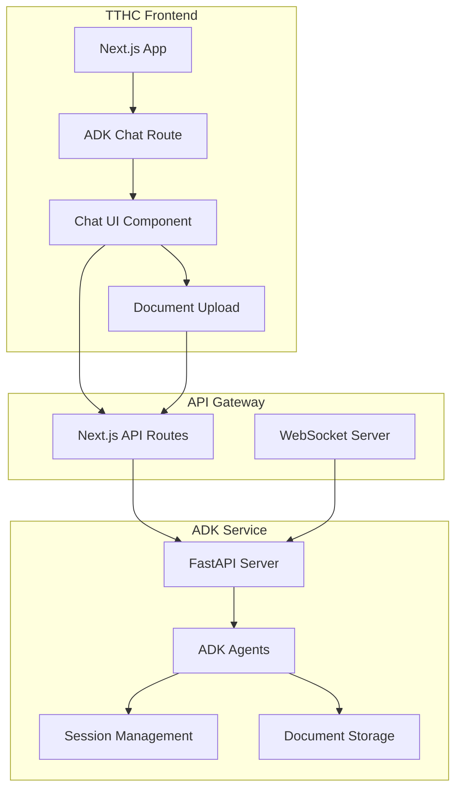

# ADK Chat Integration Plan for TTHC Application

## Executive Summary

This document outlines a comprehensive plan to integrate the already-deployed Google Agent Development Kit (ADK) service into the TTHC Next.js application. The ADK service is live at `https://adk-service-418025649220.us-east4.run.app` and provides AI-powered assistance for Vietnamese birth certificate registration through multiple specialized agents.

## Quick Start Guide

**ADK Service is already live at:** `https://adk-service-418025649220.us-east4.run.app`

To quickly integrate ADK chat into your TTHC app:

1. **Add environment variable:**
   ```bash
   echo "NEXT_PUBLIC_ADK_SERVICE_URL=https://adk-service-418025649220.us-east4.run.app" >> apps/web/.env.local
   ```

2. **Install dependencies:**
   ```bash
   cd apps/web
   bun add react-dropzone
   ```

3. **Create the chat route and components** (see Implementation Code section)

4. **Test the integration:**
   ```bash
   bun dev
   # Navigate to http://localhost:3002/adk-chat
   ```

## Table of Contents

1. [Project Overview](#project-overview)
2. [Current State Analysis](#current-state-analysis)
3. [Integration Architecture](#integration-architecture)
4. [Implementation Strategy](#implementation-strategy)
5. [Technical Requirements](#technical-requirements)
6. [Development Phases](#development-phases)
7. [API Design](#api-design)
8. [Security Considerations](#security-considerations)
9. [Testing Strategy](#testing-strategy)
10. [Deployment Plan](#deployment-plan)
11. [Timeline & Milestones](#timeline--milestones)

## Project Overview

### Goals
- Integrate ADK's Vietnamese birth registration agents into TTHC application
- Create a dedicated chat interface for AI-powered assistance
- Maintain separation of concerns between frontend and backend services
- Enable document upload and processing capabilities
- Provide real-time, context-aware guidance for birth certificate registration

### Key Features
- **Intelligent Chat Interface**: Natural language conversation with AI agents
- **Document Processing**: Upload and analyze Vietnamese government documents
- **Multi-Agent Orchestration**: Leverage specialized sub-agents for different tasks
- **Validation & Compliance**: Ensure documents meet Vietnamese legal requirements
- **Contextual Assistance**: Provide personalized guidance based on user's specific situation

## Current State Analysis

### ADK Project Structure
```
kieng-gfs-2025-adk/
├── main.py                     # FastAPI entry point with ADK integration
├── k_agents/                   # Agent definitions
│   ├── agent.py               # Orchestrator agent
│   ├── sub_agents/            # Specialized agents
│   │   ├── classification/    # Legal research & requirements
│   │   ├── document_processor/ # Image processing & OCR
│   │   ├── validator/         # Data validation
│   │   ├── ground_truth/      # Database operations
│   │   └── delivery/          # Email notifications
│   └── tools/                 # Custom tools for agents
└── models/                    # Pydantic models for validation
```

### TTHC Application Structure
```
tthc/
├── apps/
│   ├── web/                  # Next.js frontend
│   │   └── src/
│   │       ├── app/
│   │       │   └── ai/       # Existing AI chat page
│   │       └── components/   # UI components
│   └── server/               # Backend services
│       └── src/
│           ├── app/          # API routes
│           └── routers/      # Business logic
└── packages/                 # Shared packages
```

### Current Capabilities

#### ADK Agents
1. **OrchestratorAgent**: Main coordinator for all sub-agents
2. **ClassificationAgent**: Legal research and document requirements
3. **DocumentProcessorAgent**: Vision-based document analysis
4. **ValidatorAgent**: Pydantic model validation
5. **GroundTruthAgent**: Database operations
6. **DeliveryAgent**: Email notifications

#### TTHC Application
- Next.js 15.5 with App Router
- Existing AI chat interface using `@ai-sdk/react`
- TanStack Query for data fetching
- Better Auth for authentication
- Tailwind CSS for styling

## Integration Architecture

### High-Level Architecture



### Component Integration Pattern

```typescript
// Frontend Components
├── ADKChatPage         // Main chat interface
├── ChatMessageList     // Message display
├── ChatInput          // User input with file upload
├── DocumentUploader   // Document processing UI
└── AgentStatusIndicator // Show which agent is active

// Backend Services
├── ADKProxyService    // Proxy requests to ADK
├── SessionManager     // Manage chat sessions
├── FileHandler        // Process document uploads
└── StreamingAdapter   // Handle streaming responses
```

## Implementation Strategy

### Current State: ADK Service Already Deployed

The ADK service is already deployed and accessible at:
- **Production URL**: `https://adk-service-418025649220.us-east4.run.app`
- **API Documentation**: `https://adk-service-418025649220.us-east4.run.app/docs`
- **Available Apps**: orchestrator, shared_libraries, sub_agents, tools

### Integration Approach: API Client Integration

Since the ADK service is already deployed, our integration strategy simplifies to:

1. **Direct API Integration**: Connect to the deployed Cloud Run service
2. **Next.js API Routes**: Create proxy routes for authentication and session management
3. **Client-Side Chat Interface**: Build a rich chat UI that communicates with ADK
4. **File Upload Handling**: Implement document upload through the ADK API

**Advantages of this approach:**
- No infrastructure management needed
- ADK service is already scaled and maintained
- Faster implementation timeline
- Focus on frontend and user experience
- Reduced deployment complexity

## Technical Requirements

### Frontend Requirements
```json
{
  "dependencies": {
    "@ai-sdk/react": "^2.0.9",
    "react-dropzone": "^14.2.3",
    "socket.io-client": "^4.5.0",
    "markdown-to-jsx": "^7.3.2",
    "react-syntax-highlighter": "^15.5.0"
  }
}
```

### Backend Requirements
```python
# requirements.txt additions
fastapi==0.104.1
uvicorn[standard]==0.24.0
python-multipart==0.0.6
aiofiles==23.2.1
redis==5.0.1
celery==5.3.4
```

### Infrastructure Requirements
- Docker & Docker Compose
- Redis (for session management)
- PostgreSQL (optional, for persistent storage)
- Cloud Storage (for document uploads)
- SSL certificates for HTTPS

## Development Phases (Simplified for Deployed Service)

### Phase 1: API Integration Setup (2-3 Days)
**Objective**: Establish connection with deployed ADK service

**Tasks**:
1. Create ADK API client library
2. Set up environment variables for ADK service URL
3. Implement session management logic
4. Create Next.js API proxy routes
5. Test connectivity with deployed service

**Deliverables**:
- Working API client
- Session creation and management
- Basic request/response flow

### Phase 2: Chat Interface Implementation (3-4 Days)
**Objective**: Build complete chat functionality

**Tasks**:
1. Create dedicated `/adk-chat` route in Next.js
2. Implement message sending and receiving
3. Build chat UI with message history
4. Add real-time response streaming
5. Implement agent status indicators

**Code Structure**:
```typescript
// apps/web/src/app/adk-chat/page.tsx
export default function ADKChatPage() {
  // Main chat interface
}

// apps/web/src/components/adk/ChatInterface.tsx
export function ChatInterface() {
  // Chat UI components
}

// apps/server/src/app/api/adk/route.ts
export async function POST(request: Request) {
  // Proxy to ADK service
}
```

### Phase 3: Document Processing Integration (2-3 Days)
**Objective**: Enable document upload and processing

**Tasks**:
1. Implement file upload component
2. Integrate with ADK document processing endpoints
3. Add progress indicators
4. Display processing results
5. Handle error states

**API Endpoints**:
```typescript
POST /api/adk/upload     // Upload documents
GET  /api/adk/status/:id // Check processing status
GET  /api/adk/results/:id // Get processing results
```

### Phase 4: Polish & Production Ready (2-3 Days)
**Objective**: Finalize features and prepare for production

**Tasks**:
1. Add error handling and retry logic
2. Implement user authentication integration
3. Add loading states and animations
4. Create user onboarding flow
5. Performance optimization
6. Documentation and testing

**Total Timeline: 10-13 Days** (vs 5 weeks originally)

## API Design

### Actual ADK Service Endpoints (Live)

```yaml
# Core Endpoints
GET    /list-apps                                                    # List available apps
GET    /health                                                       # Health check

# Session Management
POST   /apps/{app_name}/users/{user_id}/sessions                    # Create new session
GET    /apps/{app_name}/users/{user_id}/sessions/{session_id}       # Get session details
DELETE /apps/{app_name}/users/{user_id}/sessions/{session_id}       # Delete session

# Chat/Message Handling (via WebSocket or streaming)
POST   /apps/{app_name}/users/{user_id}/sessions/{session_id}/invoke # Send message & get response

# Debug Endpoints
GET    /debug/trace/{event_id}                                      # Get trace for event
GET    /debug/trace/session/{session_id}                            # Get session trace

# Available Apps:
- orchestrator     # Main agent orchestrator
- shared_libraries # Shared utilities
- sub_agents      # Specialized agents
- tools           # Agent tools
```

### Next.js Proxy Routes

```typescript
// apps/server/src/app/api/adk/chat/route.ts
import { NextRequest, NextResponse } from 'next/server';

export async function POST(request: NextRequest) {
  const body = await request.json();
  
  // Forward to ADK service
  const response = await fetch(`${ADK_SERVICE_URL}/chat/sessions/${body.sessionId}/messages`, {
    method: 'POST',
    headers: {
      'Content-Type': 'application/json',
    },
    body: JSON.stringify(body),
  });
  
  // Stream response back
  return new Response(response.body, {
    headers: {
      'Content-Type': 'text/event-stream',
      'Cache-Control': 'no-cache',
      'Connection': 'keep-alive',
    },
  });
}
```

### Message Format

```typescript
interface ChatMessage {
  id: string;
  sessionId: string;
  role: 'user' | 'assistant' | 'system';
  content: string;
  timestamp: string;
  metadata?: {
    agent?: string;
    documents?: string[];
    validationResults?: any;
  };
}

interface DocumentUpload {
  id: string;
  sessionId: string;
  filename: string;
  mimeType: string;
  size: number;
  status: 'pending' | 'processing' | 'completed' | 'failed';
  results?: {
    documentType: string;
    extractedData: Record<string, any>;
    validationStatus: 'valid' | 'invalid';
    errors?: string[];
  };
}
```

## Security Considerations

### Authentication & Authorization
1. Integrate with existing Better Auth system
2. Add session-based access control
3. Implement rate limiting per user
4. Add CORS configuration for ADK service

### Data Security
1. Encrypt documents at rest
2. Use HTTPS for all communications
3. Implement input sanitization
4. Add content filtering for sensitive data
5. Secure file upload with virus scanning

### API Security
```typescript
// Middleware for ADK routes
export async function adkAuthMiddleware(request: NextRequest) {
  const session = await getSession(request);
  
  if (!session) {
    return NextResponse.json({ error: 'Unauthorized' }, { status: 401 });
  }
  
  // Add user context to ADK request
  request.headers.set('X-User-Id', session.userId);
  request.headers.set('X-Session-Id', session.id);
  
  return NextResponse.next();
}
```

## Testing Strategy

### Unit Tests
```typescript
// Test chat message handling
describe('ADK Chat Integration', () => {
  it('should send message to ADK service', async () => {
    const response = await sendMessage({
      sessionId: 'test-session',
      content: 'I need help with birth registration',
    });
    
    expect(response.status).toBe(200);
    expect(response.data.agent).toBe('OrchestratorAgent');
  });
  
  it('should handle document upload', async () => {
    const file = new File(['content'], 'birth-cert.pdf');
    const response = await uploadDocument(file);
    
    expect(response.status).toBe(200);
    expect(response.data.status).toBe('processing');
  });
});
```

### Integration Tests
1. End-to-end chat flow testing
2. Document processing pipeline
3. Multi-agent coordination
4. Session management
5. Error recovery scenarios

### Performance Tests
- Load testing with concurrent users
- Document processing throughput
- Response time benchmarks
- Memory usage monitoring

## Deployment Plan (Simplified)

### Local Development
Since ADK is already deployed, local development only requires the TTHC application:

```bash
# Set environment variable
export NEXT_PUBLIC_ADK_SERVICE_URL=https://adk-service-418025649220.us-east4.run.app

# Run development server
cd apps/web
bun dev
```

### Docker Compose (Optional for local testing)
```yaml
# docker-compose.yml
version: '3.8'
services:
  tthc-web:
    build: ./apps/web
    ports:
      - "3002:3002"
    environment:
      - NEXT_PUBLIC_ADK_SERVICE_URL=https://adk-service-418025649220.us-east4.run.app
      - NEXT_PUBLIC_SERVER_URL=http://localhost:3001
```

### Staging Environment
1. Deploy ADK to Cloud Run
2. Configure Cloud SQL for session storage
3. Set up Cloud Storage for documents
4. Deploy TTHC to Vercel/Railway
5. Configure environment variables

### Production Deployment
1. Set up production Google Cloud project
2. Configure Vertex AI credentials
3. Deploy ADK with auto-scaling
4. Set up monitoring and alerting
5. Configure backup and recovery

### Deployment Commands
```bash
# Deploy ADK service
cd ../kieng-gfs-2025-adk
gcloud run deploy adk-service \
  --source . \
  --region us-central1 \
  --allow-unauthenticated \
  --set-env-vars="GOOGLE_GENAI_USE_VERTEXAI=true"

# Update TTHC environment
cd apps/web
echo "ADK_SERVICE_URL=https://adk-service-xxx.run.app" >> .env.production
npm run build
npm run deploy
```

## Timeline & Milestones

### Week 1: Foundation
- ✅ Docker setup complete
- ✅ Basic connectivity established
- ✅ Development environment ready

### Week 2: Core Integration
- ✅ Chat interface implemented
- ✅ Streaming responses working
- ✅ Session management active

### Week 3: Document Processing
- ✅ File upload functional
- ✅ Document processing pipeline
- ✅ Results visualization

### Week 4: Enhancement
- ✅ Advanced features added
- ✅ UI/UX improvements
- ✅ Performance optimization

### Week 5: Production
- ✅ Security audit complete
- ✅ Deployment successful
- ✅ Documentation finalized

## Risk Mitigation

### Technical Risks
1. **API Compatibility**: Regular testing of ADK API changes
2. **Performance**: Implement caching and optimize queries
3. **Scalability**: Use horizontal scaling for ADK service
4. **Data Loss**: Regular backups and session persistence

### Operational Risks
1. **Service Downtime**: Implement health checks and auto-restart
2. **Cost Overruns**: Monitor API usage and set quotas
3. **Security Breaches**: Regular security audits and updates

## Success Metrics

### Technical Metrics
- Response time < 2 seconds for chat messages
- Document processing < 10 seconds
- 99.9% uptime for service availability
- < 1% error rate for API calls

### User Metrics
- User satisfaction score > 4.5/5
- Average session duration > 5 minutes
- Document processing success rate > 95%
- Return user rate > 60%

## Next Steps

1. **Immediate Actions**:
   - Set up development environment
   - Create feature branch for integration
   - Begin Docker configuration

2. **Team Coordination**:
   - Schedule kick-off meeting
   - Assign development tasks
   - Set up daily standups

3. **Documentation**:
   - Create API documentation
   - Write user guides
   - Prepare deployment runbooks

## Appendix

### A. Environment Variables (Updated)
```bash
# TTHC Application (.env.local)
NEXT_PUBLIC_ADK_SERVICE_URL=https://adk-service-418025649220.us-east4.run.app
NEXT_PUBLIC_MAX_FILE_SIZE=10485760
NEXT_PUBLIC_ALLOWED_FILE_TYPES=image/*,application/pdf

# Optional: For server-side proxy (if not using direct client-side calls)
ADK_SERVICE_URL=https://adk-service-418025649220.us-east4.run.app

# Authentication (if using Better Auth)
AUTH_SECRET=your-auth-secret
NEXTAUTH_URL=http://localhost:3002
```

### B. File Structure for New Components
```
apps/web/src/
├── app/
│   └── adk-chat/
│       ├── page.tsx
│       ├── layout.tsx
│       └── loading.tsx
├── components/
│   └── adk/
│       ├── ChatInterface.tsx
│       ├── MessageList.tsx
│       ├── MessageInput.tsx
│       ├── DocumentUploader.tsx
│       ├── AgentIndicator.tsx
│       └── ProcessingStatus.tsx
└── lib/
    └── adk/
        ├── client.ts
        ├── types.ts
        └── utils.ts
```

### C. Implementation Code for Deployed ADK Service

#### 1. ADK API Client
```typescript
// apps/web/src/lib/adk/client.ts
export class ADKClient {
  private baseUrl = 'https://adk-service-418025649220.us-east4.run.app';
  private appName = 'orchestrator';
  
  constructor(private userId: string) {}
  
  async createSession() {
    const response = await fetch(
      `${this.baseUrl}/apps/${this.appName}/users/${this.userId}/sessions`,
      { method: 'POST' }
    );
    return response.json();
  }
  
  async sendMessage(sessionId: string, message: string) {
    const response = await fetch(
      `${this.baseUrl}/apps/${this.appName}/users/${this.userId}/sessions/${sessionId}/invoke`,
      {
        method: 'POST',
        headers: { 'Content-Type': 'application/json' },
        body: JSON.stringify({ message }),
      }
    );
    
    // Handle streaming response
    const reader = response.body?.getReader();
    const decoder = new TextDecoder();
    
    return {
      async *[Symbol.asyncIterator]() {
        while (true) {
          const { done, value } = await reader!.read();
          if (done) break;
          yield decoder.decode(value);
        }
      }
    };
  }
}
```

#### 2. Next.js API Route Proxy
```typescript
// apps/web/src/app/api/adk/chat/route.ts
import { NextRequest } from 'next/server';
import { auth } from '@/lib/auth';

const ADK_SERVICE_URL = 'https://adk-service-418025649220.us-east4.run.app';

export async function POST(request: NextRequest) {
  const session = await auth();
  if (!session?.user) {
    return new Response('Unauthorized', { status: 401 });
  }
  
  const { sessionId, message } = await request.json();
  const userId = session.user.id;
  
  // Forward to ADK service
  const response = await fetch(
    `${ADK_SERVICE_URL}/apps/orchestrator/users/${userId}/sessions/${sessionId}/invoke`,
    {
      method: 'POST',
      headers: { 'Content-Type': 'application/json' },
      body: JSON.stringify({ message }),
    }
  );
  
  // Return streaming response
  return new Response(response.body, {
    headers: {
      'Content-Type': 'text/event-stream',
      'Cache-Control': 'no-cache',
    },
  });
}
```

#### 3. Chat Interface Component
```typescript
// apps/web/src/app/adk-chat/page.tsx
'use client';

import { useState, useEffect } from 'react';
import { useSession } from 'next-auth/react';

export default function ADKChatPage() {
  const { data: session } = useSession();
  const [sessionId, setSessionId] = useState<string | null>(null);
  const [messages, setMessages] = useState<any[]>([]);
  const [input, setInput] = useState('');
  const [isLoading, setIsLoading] = useState(false);
  
  useEffect(() => {
    if (session?.user) {
      initializeSession();
    }
  }, [session]);
  
  const initializeSession = async () => {
    const res = await fetch('/api/adk/session', { method: 'POST' });
    const data = await res.json();
    setSessionId(data.id);
  };
  
  const sendMessage = async () => {
    if (!input.trim() || !sessionId) return;
    
    const userMessage = { role: 'user', content: input };
    setMessages(prev => [...prev, userMessage]);
    setInput('');
    setIsLoading(true);
    
    try {
      const response = await fetch('/api/adk/chat', {
        method: 'POST',
        headers: { 'Content-Type': 'application/json' },
        body: JSON.stringify({ sessionId, message: input }),
      });
      
      const reader = response.body?.getReader();
      const decoder = new TextDecoder();
      let assistantMessage = { role: 'assistant', content: '' };
      
      while (true) {
        const { done, value } = await reader!.read();
        if (done) break;
        
        const chunk = decoder.decode(value);
        assistantMessage.content += chunk;
        setMessages(prev => [...prev.slice(0, -1), { ...assistantMessage }]);
      }
    } catch (error) {
      console.error('Error sending message:', error);
    } finally {
      setIsLoading(false);
    }
  };
  
  return (
    <div className="flex flex-col h-screen">
      <div className="flex-1 overflow-y-auto p-4">
        {messages.map((msg, idx) => (
          <div key={idx} className={`mb-4 ${msg.role === 'user' ? 'text-right' : ''}`}>
            <div className={`inline-block p-3 rounded-lg ${
              msg.role === 'user' ? 'bg-blue-500 text-white' : 'bg-gray-200'
            }`}>
              {msg.content}
            </div>
          </div>
        ))}
        {isLoading && <div>AI is thinking...</div>}
      </div>
      
      <div className="border-t p-4">
        <div className="flex gap-2">
          <input
            type="text"
            value={input}
            onChange={(e) => setInput(e.target.value)}
            onKeyDown={(e) => e.key === 'Enter' && sendMessage()}
            className="flex-1 p-2 border rounded"
            placeholder="Ask about birth certificate registration..."
          />
          <button
            onClick={sendMessage}
            disabled={isLoading}
            className="px-4 py-2 bg-blue-500 text-white rounded disabled:opacity-50"
          >
            Send
          </button>
        </div>
      </div>
    </div>
  );
}
```

---

This integration plan provides a comprehensive roadmap for successfully integrating the ADK agents into the TTHC application, creating a powerful AI-assisted platform for Vietnamese birth certificate registration.
