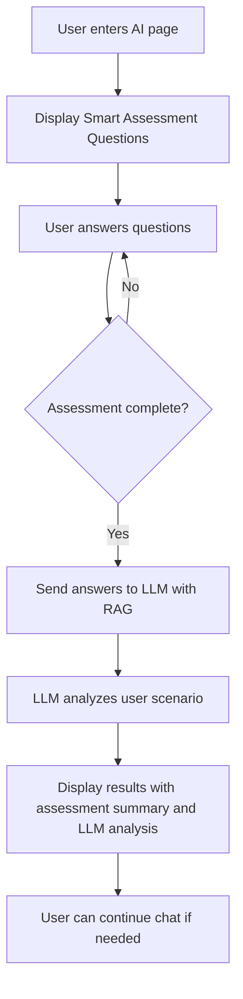

# Smart Assessment AI Integration Plan

## Overview
This plan outlines the integration of the smart assessment component into the AI page, allowing users to quickly identify their case through boolean questions and then receive personalized document requirements via LLM analysis with RAG capabilities.

## Architecture Flow



## Implementation Details

### 1. API Endpoint for Processing Smart Assessment

**File**: `apps/server/src/app/api/ai/process-assessment/route.ts`

**Purpose**: Create a new endpoint that receives assessment answers and uses LLM with RAG to analyze the user scenario and provide document requirements.

**Implementation**:
- Create a new API route that accepts POST requests
- The request body will contain the assessment answers
- Use the existing RAG engine (`queryRAGEngine`) to query the Vietnamese birth registration knowledge base
- Return a structured response with:
  - Analysis of the user's scenario
  - Required documents for their specific case
  - Next steps and procedures
  - Timeline and authority information
- Ensure all responses are in Vietnamese by setting the system prompt appropriately

### 2. Smart Assessment Component for AI Page

**File**: `apps/web/src/components/ai/smart-assessment-ai.tsx`

**Purpose**: A modified version of the smart assessment component that integrates with the AI page.

**Implementation**:
- Adapt the existing `SmartAssessment` component for use in the AI page
- Remove navigation elements specific to the birth registration flow
- Simplify the UI to focus on the questions only
- Use Vietnamese language throughout
- Use shadcn/ui components (Card, Button, etc.) for consistent styling
- Implement React state management using useState hooks for assessment answers
- When assessment is complete, trigger the LLM analysis automatically

### 3. Assessment State Management

**File**: `apps/web/src/app/ai/page.tsx`

**Purpose**: Manage the assessment state within the AI page.

**Implementation**:
- Add state management for assessment answers using React's useState hook
- Track assessment completion status with a boolean flag
- Store LLM analysis results in state
- Handle the transition between assessment view and results view
- Create a custom hook `useSmartAssessmentAI` to encapsulate assessment logic

### 4. Results View Component with AI SDK Artifacts

**File**: `apps/web/src/components/ai/assessment-results.tsx`

**Purpose**: Display the assessment summary and LLM analysis side by side using Vercel AI SDK artifacts.

**Implementation**:
- Create a component that shows two panels using responsive grid layout:
  - Left panel: Assessment summary with user answers and determined scenario using shadcn/ui Card components
  - Right panel: LLM analysis with document requirements and next steps
- Use Vercel AI SDK's `streamObject` or `streamText` for displaying the LLM response
- Implement a custom hook to handle streaming of the LLM analysis
- Include visual indicators for processing steps using shadcn/ui components
- Ensure all content is in Vietnamese
- Use React Markdown for rendering formatted text from the LLM

### 5. LLM Analysis Flow

**Implementation**:
- When assessment is complete, send answers to the new API endpoint using fetch
- Display a loading indicator while the LLM is processing using shadcn/ui components
- Use Vercel AI SDK's `experimental_useObject` hook to stream the analysis results
- Show the analysis results in the results view component with real-time updates
- Allow users to continue the conversation if they have additional questions
- Handle errors gracefully with appropriate user feedback

### 6. Vietnamese Language Support

**Implementation**:
- Ensure all UI text is in Vietnamese using the existing translations from data.ts
- Configure the LLM to respond in Vietnamese by setting appropriate system prompts
- Use the existing Vietnamese translations from the data.ts file for assessment questions
- Test that all text displays correctly in Vietnamese
- Add proper font support for Vietnamese characters if needed

### 7. Visual Indicators for Processing Steps

**Implementation**:
- Add loading states during LLM processing using shadcn/ui components
- Show progress indicators for different analysis steps with descriptive text in Vietnamese
- Use animations and transitions from shadcn/ui to enhance user experience
- Display error states if processing fails with clear error messages in Vietnamese
- Implement a step-by-step visualization of the analysis process

## File Structure

```
apps/web/src/
├── app/ai/
│   └── page.tsx                          # Modified to include smart assessment
├── components/ai/
│   ├── smart-assessment-ai.tsx           # Smart assessment component for AI page
│   ├── assessment-results.tsx            # Results view with AI SDK artifacts
│   └── processing-indicator.tsx          # Visual indicator for processing steps
└── lib/
    └── hooks/
        └── use-smart-assessment-ai.ts    # Hook for assessment state management

apps/server/src/
└── app/api/ai/
    └── process-assessment/
        └── route.ts                      # New API endpoint for processing assessment
```

## Testing Plan

1. **Unit Tests**:
   - Test the smart assessment component with different answer combinations
   - Test the API endpoint with various assessment scenarios
   - Test the results view component with different response formats

2. **Integration Tests**:
   - Test the complete flow from assessment to results
   - Test error handling and edge cases
   - Test Vietnamese language display

3. **User Acceptance Tests**:
   - Verify the assessment questions display correctly
   - Verify the LLM analysis provides accurate document requirements
   - Verify the results view shows both assessment summary and analysis

## Success Criteria

1. Users see the smart assessment questions immediately when entering the AI page
2. The assessment determines the correct scenario based on user answers
3. The LLM provides accurate document requirements based on the assessment
4. All text is displayed in Vietnamese
5. The results view shows both assessment summary and LLM analysis side by side
6. Users can continue the conversation after receiving the analysis

## Timeline Estimate

- API endpoint creation: 1 day
- Smart assessment component for AI page: 1 day
- Results view component: 1 day
- Integration and state management: 1 day
- Testing and refinement: 1 day
- Total: 5 days